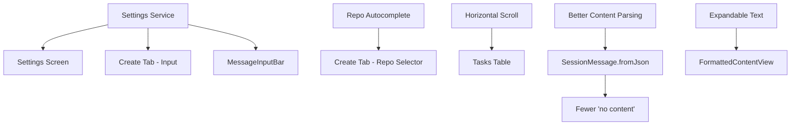

# Implementation Plan — Kiro Mobile UX Fixes

**Date:** 2026-03-22
**Status:** Approved

## Problem Statement

Six UX issues across the Create, Tasks, and Session Detail screens make the app frustrating to use on mobile — an unscrollable repo dropdown, awkward newline behavior, overlapping table columns, truncated message content, excessive "(no content)" placeholders, and the same newline issue in the reply input.

## Requirements

1. Repo selector on Create screen → searchable autocomplete with multi-select chips
2. Enter key behavior → configurable via a new Settings screen (gear icon in app bar), default to "enter = new line" on mobile
3. Tasks table → horizontally scrollable to prevent column overlap
4. Session detail messages → expandable/collapsible for long text blocks
5. "(no content)" → reduce by improving content extraction in `SessionMessage.fromJson` (fall back to raw JSON instead of null)
6. Reply input bar → respect the same enter key setting from #2

## Background

- The repo selector is a `PopupMenuButton` in `_RepoDropdown` (`home_view.dart`) — no filtering capability
- There's no settings/preferences system; no settings screen or persistent storage for user prefs
- The Tasks table in `TasksTab` has 6 `FlexColumnWidth` columns in a `Table` widget — no horizontal scroll
- `SessionMessage.fromJson` (`kiro_api.dart:608-635`) only extracts content from `text.content`, `text` (string), or first `toolResult.content[0].text` — anything else results in `content = null`
- `ContentFormatter.format()` maps `null`/empty content to `"(no content)"`
- `MessageInputBar` uses `textInputAction: TextInputAction.send` + `onSubmitted` — Enter always sends
- The app bar actions are in `app_shell.dart` line ~225: refresh, API metrics, debug log, logout

## Proposed Solution

Build a lightweight settings service (persisted via `SharedPreferences`), wire it into the app bar, and fix each screen issue incrementally.

## Task Breakdown

### Task 1: Create the Settings service with persistent storage

- **Objective:** Build a minimal `SettingsService` (ChangeNotifier) that stores user preferences using `SharedPreferences`
- Add `shared_preferences` to `pubspec.yaml`
- Create `lib/services/settings_service.dart` with a `SettingsService` class that exposes a `bool enterToSend` property (default `false` on mobile, `true` on web to preserve current behavior)
- Initialize it in `main.dart` and provide it via `Provider`
- **Test:** Unit test that `SettingsService` reads/writes the enter key preference
- **Demo:** Service initializes and persists a preference value across restarts

### Task 2: Add Settings screen and gear icon to app bar

- **Objective:** Create a `SettingsView` screen and add a gear icon to the app bar in `app_shell.dart`
- Create `lib/views/settings_view.dart` with a simple list tile toggle for "Enter sends message" (SwitchListTile)
- Add a `Icons.settings` IconButton to the app bar actions in `app_shell.dart` (between debug log and logout)
- Tapping it pushes the `SettingsView` via `Navigator.push`
- **Test:** Widget test that the settings screen renders and the toggle updates the setting
- **Demo:** Gear icon visible in app bar, tapping opens settings, toggling the switch persists the preference

### Task 3: Wire enter key setting into Create tab prompt field

- **Objective:** Make the Create tab's prompt `TextField` respect the enter key setting
- In `CreateTab` (`home_view.dart`), read `SettingsService` from context
- When `enterToSend` is true, Enter submits (current behavior); when false, Enter inserts a newline
- Update the hint text ("New line shift+enter" / "New line enter") to reflect the current setting
- **Test:** Widget test that Enter inserts newline when setting is off, and submits when on
- **Demo:** Changing the setting in Settings immediately changes Enter behavior in the Create prompt

### Task 4: Wire enter key setting into MessageInputBar

- **Objective:** Make `MessageInputBar` respect the same setting
- Read `SettingsService` in `MessageInputBar`
- When `enterToSend` is false, remove `textInputAction: TextInputAction.send` and `onSubmitted`, so Enter inserts a newline; add a send button (already exists) as the primary send mechanism
- When `enterToSend` is true, keep current behavior
- **Test:** Widget test for both modes
- **Demo:** In a session detail view, Enter inserts newline or sends based on the setting

### Task 5: Replace repo dropdown with searchable autocomplete

- **Objective:** Replace `_RepoDropdown` (`PopupMenuButton`) with a typeahead/autocomplete widget
- Use Flutter's built-in `Autocomplete` widget (or `RawAutocomplete`) to show a text field that filters repos as the user types
- Keep the existing multi-select chip behavior — selecting a repo adds a chip, the autocomplete field clears and is ready for the next selection
- Filter out already-selected repos from suggestions
- **Test:** Widget test that typing filters the list and selecting adds a chip
- **Demo:** On Create screen, typing in the repo field filters repos in real-time, selecting adds a chip

### Task 6: Make Tasks table horizontally scrollable

- **Objective:** Wrap the Tasks tab table in a horizontal scroll view to prevent column overlap
- In `TasksTab.build()` (`home_view.dart`), wrap the `Table` widget in a `SingleChildScrollView(scrollDirection: Axis.horizontal)` with a constrained minimum width (e.g., 700px) so columns have breathing room
- Apply the same fix to the Chats tab table for consistency
- **Test:** Widget test that the table renders inside a horizontal scroll view
- **Demo:** Tasks and Chats tables scroll horizontally on narrow screens, no column overlap

### Task 7: Improve content extraction to reduce "(no content)"

- **Objective:** Make `SessionMessage.fromJson` more resilient so fewer messages end up with null content
- In `kiro_api.dart`, when `rawContent` is a Map but doesn't match known patterns, fall back to `jsonEncode(rawContent)` instead of leaving `content` as null
- When `rawContent` is a String, use it directly
- When `rawContent` is a List, encode it as JSON
- This ensures the `ContentFormatter` gets *something* to work with rather than showing "(no content)"
- **Test:** Unit test `SessionMessage.fromJson` with various content shapes (string, unknown map structure, list, nested tool results)
- **Demo:** Messages that previously showed "(no content)" now show their actual content (even if as raw JSON)

### Task 8: Add expandable/collapsible sections for long message content

- **Objective:** Make long text blocks in session messages expandable
- In `FormattedContentView` (`formatted_content_view.dart`), for `SegmentType.text` segments longer than a threshold (e.g., 300 chars or ~6 lines), show a truncated preview with a "Show more" button
- Tapping expands to full content, with a "Show less" to collapse
- This mirrors the existing expand/collapse pattern already used in `_JsonBlock`
- **Test:** Widget test that long text is truncated with a "Show more" button, and tapping expands it
- **Demo:** In a session view, long agent messages show truncated with "Show more", tapping reveals full content

## Key Files

| File | Changes |
|------|---------|
| `pubspec.yaml` | Add `shared_preferences` |
| `lib/services/settings_service.dart` | **New** — SettingsService |
| `lib/views/settings_view.dart` | **New** — Settings screen |
| `lib/main.dart` | Initialize & provide SettingsService |
| `lib/views/app_shell.dart` | Add settings gear icon to app bar |
| `lib/views/home_view.dart` | Autocomplete repo selector, enter key in CreateTab, horizontal scroll on tables |
| `lib/views/message_input_bar.dart` | Enter key setting support |
| `lib/services/kiro_api.dart` | Improve SessionMessage.fromJson content extraction |
| `lib/views/formatted_content_view.dart` | Expandable text segments |
