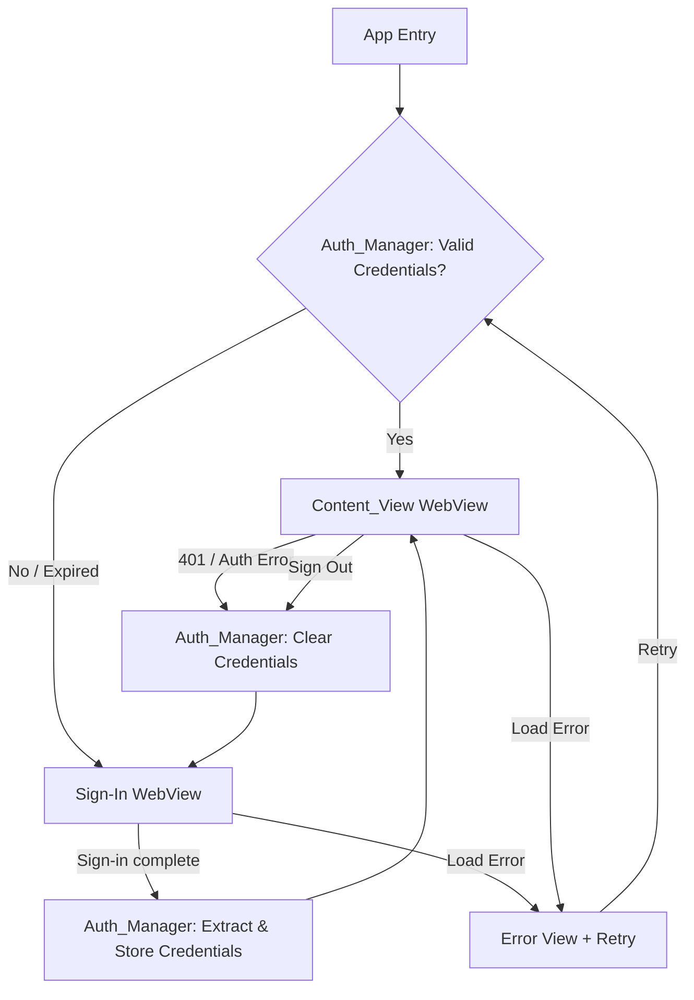
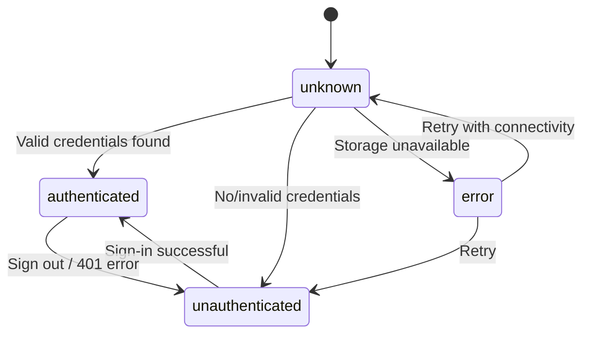

# Design Document: Kiro Flutter Auth

## Overview

This design describes a Flutter application that authenticates users via the Kiro web sign-in flow, captures resulting credentials, persists them securely per platform, and renders authenticated Kiro UI content. The app targets Web, iOS, and Android using a WebView-based approach.

The core flow is:
1. App launches → check for stored credentials
2. If valid credentials exist → show authenticated Content View
3. If no/invalid credentials → show Kiro Sign-In Page in WebView
4. On successful sign-in → extract credentials from WebView, store securely, navigate to Content View
5. Sign-out → clear credentials and WebView data, return to sign-in

## Architecture



The architecture follows a simple state-driven navigation pattern:

- **AuthState** drives which screen is displayed (sign-in, content, loading, error)
- **Auth_Manager** is the single source of truth for authentication state
- **Credential_Store** abstracts platform-specific secure storage behind a common interface
- **WebView** is used for both sign-in and content display, with credential injection

### Key Packages

| Package | Purpose |
|---|---|
| `webview_flutter` | WebView for sign-in and content rendering (iOS, Android) |
| `webview_flutter_web` | WebView support on web platform |
| `flutter_secure_storage` | Secure credential storage (Keychain/Keystore) |
| `connectivity_plus` | Network connectivity monitoring |
| `provider` or `riverpod` | State management for auth state |

## Components and Interfaces

### 1. AuthState

An enum representing the current authentication state of the app.

```dart
enum AuthState {
  unknown,      // Initial state, checking credentials
  unauthenticated, // No valid credentials, show sign-in
  authenticated,   // Valid credentials, show content
  error,           // Error state (network, storage, etc.)
}
```

### 2. AuthCredentials

A model holding the extracted authentication data.

```dart
class AuthCredentials {
  final String token;
  final DateTime? expiresAt;
  final Map<String, String> cookies;

  bool get isExpired => expiresAt != null && DateTime.now().isAfter(expiresAt!);
  bool get isValid => token.isNotEmpty && !isExpired;
}
```

### 3. CredentialStore (Abstract Interface)

Platform-agnostic interface for secure credential persistence.

```dart
abstract class CredentialStore {
  Future<AuthCredentials?> load();
  Future<void> save(AuthCredentials credentials);
  Future<void> clear();
  Future<bool> get isAvailable;
}
```

Platform implementations:
- **iOSCredentialStore** — uses iOS Keychain via `flutter_secure_storage`
- **AndroidCredentialStore** — uses Android Keystore via `flutter_secure_storage`
- **WebCredentialStore** — uses encrypted localStorage or secure cookies

### 4. AuthManager

Central component managing auth lifecycle.

```dart
abstract class AuthManager {
  AuthState get state;
  Stream<AuthState> get stateStream;

  Future<void> initialize();
  Future<void> handleSignInComplete(WebViewController controller);
  Future<AuthCredentials?> extractCredentials(WebViewController controller);
  Future<void> validateCredentials();
  Future<void> signOut();
  Future<void> handleAuthError();
}
```

Responsibilities:
- On `initialize()`: load credentials from `CredentialStore`, validate, set state
- On `handleSignInComplete()`: extract credentials from WebView cookies/tokens, save to store, transition to authenticated
- On `signOut()`: clear `CredentialStore`, clear WebView data, transition to unauthenticated
- On `handleAuthError()`: clear credentials, transition to unauthenticated

### 5. SignInView

Flutter widget that displays the Kiro sign-in page in a WebView.

```dart
class SignInView extends StatefulWidget {
  // Displays WebView loading https://app.kiro.dev/signin
  // Shows loading indicator while page loads
  // Shows error + retry on load failure
  // Monitors navigation to detect sign-in completion
  // Calls AuthManager.handleSignInComplete() on success
}
```

Detection strategy for sign-in completion:
- Monitor URL changes via `NavigationDelegate`
- When the WebView navigates away from the sign-in URL to a post-auth URL, trigger credential extraction

### 6. ContentView

Flutter widget that displays authenticated Kiro UI content.

```dart
class ContentView extends StatefulWidget {
  // Displays WebView with Kiro UI content
  // Injects Auth_Credentials (cookies/headers) into WebView requests
  // Shows loading indicator while content loads
  // Shows error + retry on load failure
  // Provides sign-out action
  // Monitors for 401 responses to trigger re-auth
}
```

### 7. ConnectivityMonitor

Wrapper around `connectivity_plus` to provide network state.

```dart
abstract class ConnectivityMonitor {
  Stream<bool> get isConnected;
  Future<bool> checkConnectivity();
}
```

### 8. AppShell

Root widget that listens to `AuthManager.stateStream` and renders the appropriate view.

```dart
class AppShell extends StatelessWidget {
  // Listens to AuthManager state
  // Renders: LoadingView, SignInView, ContentView, or ErrorView
  // Handles connectivity overlay
}
```

## Data Models

### AuthCredentials

| Field | Type | Description |
|---|---|---|
| `token` | `String` | Primary auth token (JWT or session token) |
| `expiresAt` | `DateTime?` | Token expiration timestamp (null if no expiry) |
| `cookies` | `Map<String, String>` | Cookies extracted from WebView after sign-in |

Serialization: JSON for storage in `CredentialStore`.

```dart
class AuthCredentials {
  AuthCredentials({required this.token, this.expiresAt, this.cookies = const {}});

  final String token;
  final DateTime? expiresAt;
  final Map<String, String> cookies;

  bool get isExpired => expiresAt != null && DateTime.now().isAfter(expiresAt!);
  bool get isValid => token.isNotEmpty && !isExpired;

  Map<String, dynamic> toJson() => {
    'token': token,
    'expiresAt': expiresAt?.toIso8601String(),
    'cookies': cookies,
  };

  factory AuthCredentials.fromJson(Map<String, dynamic> json) => AuthCredentials(
    token: json['token'] as String,
    expiresAt: json['expiresAt'] != null ? DateTime.parse(json['expiresAt'] as String) : null,
    cookies: Map<String, String>.from(json['cookies'] as Map? ?? {}),
  );
}
```

### AuthState Transitions



### Credential Storage Format

Credentials are serialized as JSON and stored as a single string value under the key `kiro_auth_credentials` in the platform-specific secure store.


## Correctness Properties

*A property is a characteristic or behavior that should hold true across all valid executions of a system — essentially, a formal statement about what the system should do. Properties serve as the bridge between human-readable specifications and machine-verifiable correctness guarantees.*

### Property 1: Credential serialization round trip

*For any* valid `AuthCredentials` instance (with any non-empty token, any expiration date or null, and any map of cookies), serializing to JSON via `toJson()` and then deserializing via `AuthCredentials.fromJson()` should produce an equivalent `AuthCredentials` object with the same token, expiresAt, and cookies values.

**Validates: Requirements 2.2**

### Property 2: Credential validation correctness

*For any* `AuthCredentials` instance, `isValid` should return `true` if and only if the token is non-empty AND the credentials are not expired (either `expiresAt` is null or `expiresAt` is in the future). Conversely, `isValid` should return `false` for any credentials with an empty token or a past `expiresAt`.

**Validates: Requirements 3.3, 1.1, 3.1, 3.2**

### Property 3: Initialization with valid credentials yields authenticated state

*For any* `CredentialStore` containing valid (non-expired, non-empty token) `AuthCredentials`, calling `AuthManager.initialize()` should result in the `AuthState` being `authenticated`.

**Validates: Requirements 3.1**

### Property 4: Initialization with invalid or missing credentials yields unauthenticated state

*For any* `CredentialStore` that is empty or contains invalid `AuthCredentials` (empty token or expired), calling `AuthManager.initialize()` should result in the `AuthState` being `unauthenticated` and the store being cleared.

**Validates: Requirements 1.1, 3.2**

### Property 5: Successful credential capture transitions to authenticated

*For any* valid `AuthCredentials` extracted from a sign-in flow, calling `AuthManager.handleSignInComplete()` should store the credentials in the `CredentialStore` and transition the `AuthState` to `authenticated`.

**Validates: Requirements 2.1, 2.4**

### Property 6: Sign-out clears credentials and transitions to unauthenticated

*For any* `AuthManager` in an `authenticated` state, calling `signOut()` should clear all credentials from the `CredentialStore` (loading should return null) and transition the `AuthState` to `unauthenticated`.

**Validates: Requirements 5.2, 5.4**

### Property 7: Auth error clears credentials and transitions to unauthenticated

*For any* `AuthManager` in an `authenticated` state, calling `handleAuthError()` should clear all credentials from the `CredentialStore` and transition the `AuthState` to `unauthenticated`.

**Validates: Requirements 6.2**

## Error Handling

### Credential Extraction Failure (Req 6.1)
- If `extractCredentials()` returns null or throws, the `AuthManager` sets state to `error` with a descriptive message.
- The UI displays an error screen with a "Retry" button that re-initiates the sign-in flow.

### HTTP 401 / Auth Error (Req 6.2)
- The `ContentView` WebView monitors HTTP responses. On a 401 status, it calls `AuthManager.handleAuthError()`.
- `handleAuthError()` clears the `CredentialStore` and sets state to `unauthenticated`, which triggers navigation back to `SignInView`.

### Credential Store Unavailable (Req 6.3)
- On `initialize()`, if `CredentialStore.isAvailable` returns false, set state to `error` with a message indicating secure storage is inaccessible.
- The error view shows a platform-specific message (e.g., "Keychain access denied" on iOS).

### WebView Load Failure (Req 1.4, 4.4)
- Both `SignInView` and `ContentView` handle `onWebResourceError` callbacks.
- On failure, display an inline error message with a "Retry" button that reloads the WebView.

### Network Connectivity (Req 7.1, 7.2)
- `ConnectivityMonitor` streams connectivity state.
- When offline, an overlay displays "No internet connection" with a "Retry" button.
- On retry (with connectivity restored), the app resumes the interrupted operation by re-triggering the current state's action (reload sign-in page or content page).

## Testing Strategy

### Unit Tests

Unit tests cover specific examples, edge cases, and integration points:

- **AuthCredentials.fromJson / toJson**: Specific known JSON payloads produce expected objects.
- **AuthCredentials.isValid**: Edge cases — empty token, null expiresAt, expiresAt exactly at `DateTime.now()`, far-future expiry.
- **AuthManager.initialize()**: With mocked CredentialStore — empty store, valid credentials, expired credentials, store unavailable.
- **AuthManager.signOut()**: Verify store is cleared and state transitions correctly.
- **AuthManager.handleAuthError()**: Verify store is cleared on 401 scenario.
- **ConnectivityMonitor**: Mock connectivity states and verify stream emissions.
- **Error scenarios**: Extraction failure, store unavailability, WebView load errors.

### Property-Based Tests

Property-based tests use the `dart_quickcheck` or `glados` package (Dart PBT library) with a minimum of 100 iterations per test.

Each property test references its design document property:

1. **Feature: kiro-flutter-auth, Property 1: Credential serialization round trip**
   - Generate random `AuthCredentials` (random non-empty strings for token, random DateTime or null for expiresAt, random cookie maps).
   - Assert `AuthCredentials.fromJson(credentials.toJson())` equals the original.

2. **Feature: kiro-flutter-auth, Property 2: Credential validation correctness**
   - Generate random `AuthCredentials` with varying token lengths (including empty) and expiresAt values (past, future, null).
   - Assert `isValid == (token.isNotEmpty && !isExpired)`.

3. **Feature: kiro-flutter-auth, Property 3: Initialization with valid credentials yields authenticated state**
   - Generate random valid `AuthCredentials` (non-empty token, future or null expiry).
   - Mock `CredentialStore.load()` to return them.
   - Assert `AuthManager.initialize()` results in `AuthState.authenticated`.

4. **Feature: kiro-flutter-auth, Property 4: Initialization with invalid or missing credentials yields unauthenticated state**
   - Generate random invalid `AuthCredentials` (empty token or past expiry) or null.
   - Mock `CredentialStore.load()` to return them.
   - Assert `AuthManager.initialize()` results in `AuthState.unauthenticated` and `CredentialStore.clear()` was called.

5. **Feature: kiro-flutter-auth, Property 5: Successful credential capture transitions to authenticated**
   - Generate random valid `AuthCredentials`.
   - Call `handleSignInComplete()` with mocked extraction returning those credentials.
   - Assert state is `authenticated` and `CredentialStore.save()` was called with the credentials.

6. **Feature: kiro-flutter-auth, Property 6: Sign-out clears credentials and transitions to unauthenticated**
   - Start from any authenticated state with random stored credentials.
   - Call `signOut()`.
   - Assert `CredentialStore.load()` returns null and state is `unauthenticated`.

7. **Feature: kiro-flutter-auth, Property 7: Auth error clears credentials and transitions to unauthenticated**
   - Start from any authenticated state with random stored credentials.
   - Call `handleAuthError()`.
   - Assert `CredentialStore.load()` returns null and state is `unauthenticated`.

### Test Configuration

- PBT library: `glados` (Dart property-based testing package)
- Minimum iterations: 100 per property test
- Each test tagged with: `Feature: kiro-flutter-auth, Property {N}: {title}`
- Both unit and property tests run via `flutter test`
